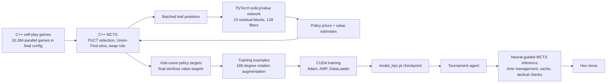

# AlphaZero-Style Hex Agent

This repository contains an 11x11 Hex game-playing agent trained through AlphaZero-style self-play and deployed as a neural-guided Monte Carlo Tree Search tournament player. The project combines a PyTorch residual policy/value network, a native C++ self-play MCTS engine, batched CUDA inference, SLURM training jobs on CSF3 GPU nodes, and a CPU-constrained tournament agent with rule-aware search and inference optimizations.

## Why this is interesting

This is more than a model checkpoint. The difficult part is the systems integration: thousands of concurrent self-play games are simulated in C++, leaf positions are batched back to PyTorch for GPU policy/value evaluation, visit-count policies are converted into training targets, and the trained network is then used inside a separate tournament-time MCTS agent. The implementation has to handle Hex-specific rules such as the swap move, exact connectivity wins, time budgets, CPU-only inference, and checkpoint compatibility between training and deployment.

## Features

- AlphaZero-style self-play for 11x11 Hex.
- Residual CNN with policy and value heads.
- Native C++ MCTS self-play engine exposed to Python through `ctypes`.
- Batched GPU inference during self-play using PyTorch AMP/autocast.
- Dirichlet root noise, visit-count policy targets, value targets from final game outcome.
- 180-degree board rotation augmentation.
- SLURM scripts for CSF3 GPU training with checkpoint resume and sync.
- Tournament agent using neural-guided MCTS, tree reuse, transposition caching, tactical win/block checks, and phase-based time allocation.
- Baseline/search experiments including Vanilla MCTS and RAVE/AMAF agents.
- Unit tests and strict agent verification scenarios.

## Architecture



## Model and training design

| Component | Evidence in repo |
| --- | --- |
| Board | 11x11 Hex with swap rule |
| Input tensor | 3 channels: current-player stones, opponent stones, player-colour plane |
| Network | 10 residual blocks, 128 filters |
| Policy head | 122 logits: 121 board cells plus swap |
| Value head | Scalar tanh output |
| Checkpoint size | `model_hpc.pt`, about 12.2 MB |
| Training loop | `ai_and_games_project_csf3_code/trainA100.py` |
| Native self-play | `ai_and_games_project_csf3_code/src/native/mcts_hex.cpp` |
| Optimized native variant | `ai_and_games_project_csf3_code/src/native/mcts_hex_optimised.cpp` |
| Tournament inference | `agents/Group35/Group_35.py` |

Training uses:

- `GAMES_PER_ITERATION = 16384` in the final `trainA100.py` config.
- `MCTS_SIMS = 800` per move during self-play.
- `EPOCHS = 10`, `BATCH_SIZE = 16384`, `LEARNING_RATE = 0.002`.
- Adam with `weight_decay=1e-4`.
- Value loss: mean squared error.
- Policy loss: cross-entropy against MCTS visit distributions.
- CUDA AMP via `torch.amp.autocast` and `GradScaler`.
- Pinned host memory and channels-last tensors for faster GPU transfer/convolution.

The optimized C++ path pads board/action buffers to 128 entries and uses AVX-512/OpenMP-oriented code for tensor construction and policy handling.

## Results and evidence

The repository includes training logs rather than a single polished experiment report. The numbers below are extracted from committed artifacts.

| Evidence | Result |
| --- | --- |
| Unit tests | `python -m unittest discover` passes 18 tests locally |
| Agent verification | `agents/CrisOptimisedGroup35/verify_agent.py` passes tensor encoding, swap mechanics, immediate win, forced block, panic mode, endgame, illegal swap, and edge-stability scenarios |
| Training scale | final logs show `16,384` parallel self-play games per iteration |
| Training examples | final-config logs show about `1.96M-2.01M` augmented examples per completed iteration |
| Training jobs | logs show CUDA training, 2 GPU jobs, checkpoint sync, and time-limited SLURM runs |

Notes:

- Several SLURM jobs were cancelled or hit time limits; this is visible in the `.err` files and reflects iterative CSF3 experimentation rather than hidden results.
- No Elo rating or official class tournament table is present in this repository.

## Project structure

```text
.
├── agents/
│   ├── Group35/                  # submitted tournament agent and checkpoint
│   ├── CrisOptimisedGroup35/      # optimized agent variant, verification and speed scripts
│   ├── VanillaMCTS/               # pure UCT MCTS baseline
│   ├── RAVE/                      # RAVE/AMAF MCTS baseline
│   └── DefaultAgents/             # coursework baseline agents
├── ai_and_games_project_csf3_code/
│   ├── trainA100.py               # main self-play training pipeline
│   ├── trainA100_optimised.py     # padded/AVX-512-oriented training variant
│   ├── src/native/                # C++ MCTS engines and compiled shared libraries
│   ├── run.slurm                  # CSF3 GPU training job
│   ├── run_optimised.slurm        # optimized training job
│   ├── hex_train_*.out/.err       # training logs
│   └── model_hpc*.pt              # trained checkpoints
├── src/                           # Hex engine: board, game, moves, colours
├── test/                          # unit tests for game logic
├── Hex.py                         # run one Hex game
├── HexTournament.py               # tournament runner
├── HeadToHead.py                  # multiprocessing head-to-head evaluator
└── Dockerfile                     # coursework runtime environment
```

## Quick start

### 1. Create an environment

For local inspection and tests, Python 3.11+ with PyTorch and NumPy is sufficient.

```bash
python -m pip install torch numpy pandas scikit-learn
```

The coursework Dockerfile defines the intended runtime:

```bash
docker build --build-arg UID=$UID -t hex .
docker run --cpus=8 --memory=8G -v "$(pwd)":/home/hex --name hex --rm -it hex /bin/bash
```

### 2. Run tests

```bash
python -m unittest discover
```

On Windows, the strict agent verification script needs UTF-8 output because it prints status symbols:

```powershell
$env:PYTHONIOENCODING='utf-8'
python agents\CrisOptimisedGroup35\verify_agent.py
```

On Linux/macOS:

```bash
PYTHONIOENCODING=utf-8 python agents/CrisOptimisedGroup35/verify_agent.py
```

### 3. Run a game

Default naive-vs-naive game:

```bash
python Hex.py
```

Run the submitted neural-MCTS agent against a baseline agent:

```bash
python Hex.py \
  -p1 "agents.Group35.Group_35 TournamentAgent" -p1Name Group35 \
  -p2 "agents.DefaultAgents.NaiveAgent NaiveAgent" -p2Name Naive
```

The tournament agent is time-managed for full games, so this can take minutes.

### 4. Run head-to-head evaluation

```bash
python HeadToHead.py -n 1 -i 2 \
  -p1 "agents.Group35.Group_35 TournamentAgent" -p1Name Group35 \
  -p2 "agents.VanillaMCTS.VanillaMCTS VanillaMCTSAgent" -p2Name VanillaMCTS
```

Increase `-n` and `-i` for more games. The neural-MCTS agent is time-managed for full games, so larger evaluations can take a while.

## Training on CSF3

The full training pipeline is designed for Linux HPC nodes with CUDA and the compiled native MCTS library.

### Compile native MCTS

```bash
cd ai_and_games_project_csf3_code
bash compile_mcts.sh
```

For the AVX-512-oriented variant:

```bash
bash compile_mcts_optimised.sh
```

### Submit training

```bash
sbatch run.slurm
```

The SLURM job requests:

- `2` GPUs
- `24` CPU cores
- `240G` memory
- CUDA modules
- temporary fast storage under `$TMPDIR`
- checkpoint copy-back to the submit directory

The helper script submits and tails the log:

```bash
bash submit_job.sh
```

The optimized variant is:

```bash
sbatch run_optimised.slurm
```

## Inference agent

The submitted tournament agent in `agents/Group35/Group_35.py` loads `model_hpc.pt` and runs neural-guided MCTS on CPU. It includes:

- model loading with `DataParallel` and `torch.compile` prefix cleanup;
- dynamic quantization attempt and TorchScript tracing;
- 8-thread PyTorch configuration and MKL-DNN enablement;
- NumPy board representation for search;
- transposition table keyed by board bytes and player;
- root reuse between turns;
- reset logic after swap moves;
- Union-Find immediate win/block detection;
- policy-prior filtering to focus MCTS expansion;
- time allocation by game phase.

## Technical decisions and tradeoffs

- **C++ for self-play, Python for learning:** MCTS expansion and game simulation are performance-critical and implemented natively; neural training remains in PyTorch for GPU batching and optimizer support.
- **Batched leaf evaluation:** The C++ engine prepares many leaf states, then Python evaluates them as one GPU batch. This avoids one neural forward pass per game state.
- **Tree reset during training self-play:** The C++ training engine resets each game tree after a move. This is simpler and memory-stable at high parallelism, at the cost of not preserving subtrees during self-play.
- **Exact Hex connectivity checks:** Union-Find is used instead of repeated graph search for fast win detection.
- **CPU tournament deployment:** The final agent targets the coursework container limits rather than assuming GPU availability at match time.
- **Logged, iterative HPC work:** Training logs include failed and time-limited jobs. They are left in the repo because they make the experimentation trail inspectable.

## Artifacts

- Main tournament checkpoint: `agents/Group35/model_hpc.pt`
- Training checkpoints: `ai_and_games_project_csf3_code/model_hpc.pt`, `model_hpc_v1_no_noise.pt`
- Game rules/coursework document: `Hex game doc.pdf`
- Training logs: `ai_and_games_project_csf3_code/hex_train_*.out`
- SLURM logs/errors: `ai_and_games_project_csf3_code/hex_train_*.err`

## Limitations

- No official Elo rating or formal tournament table is committed.
- Training data is generated online by self-play; there is no standalone dataset release.
- Full training requires CSF3-like Linux GPU infrastructure and is not intended as a laptop command.
- Some older/experimental folders are retained for comparison and may not represent the final submitted agent.
